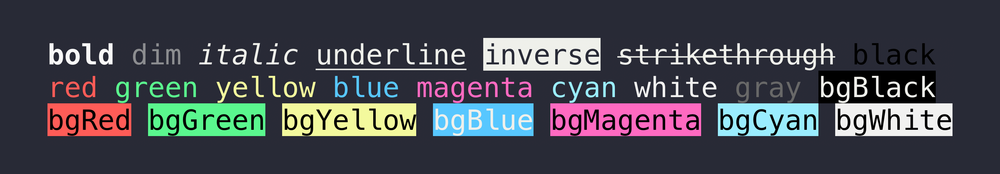

<h1 align="center">
	<br>
	<br>
	
	<br>
	<br>
	<br>
</h1>

> Terminal string styling done right

[](https://codecov.io/gh/chalk/chalk)
[](https://www.npmjs.com/package/chalk?activeTab=dependents)
[](https://www.npmjs.com/package/chalk)



## Info

- [Why not switch to a smaller coloring package?](https://github.com/chalk/chalk?tab=readme-ov-file#why-not-switch-to-a-smaller-coloring-package)
- See [yoctocolors](https://github.com/sindresorhus/yoctocolors) for a smaller alternative

## Highlights

- Expressive API
- Highly performant
- No dependencies
- Ability to nest styles
- [256/Truecolor color support](#256-and-truecolor-color-support)
- Auto-detects color support
- Doesn't extend `String.prototype`
- Clean and focused
- Actively maintained
- [Used by ~115,000 packages](https://www.npmjs.com/browse/depended/chalk) as of July 4, 2024

## Install

```sh
npm install chalk
```

**IMPORTANT:** Chalk 5 is ESM. If you want to use Chalk with TypeScript or a build tool, you will probably want to use Chalk 4 for now. [Read more.](https://github.com/chalk/chalk/releases/tag/v5.0.0)

## Usage

```js
import chalk from 'chalk';

console.log(chalk.blue('Hello world!'));
```

Chalk comes with an easy to use composable API where you just chain and nest the styles you want.

```js
import chalk from 'chalk';

const log = console.log;

// Combine styled and normal strings
log(chalk.blue('Hello') + ' World' + chalk.red('!'));

// Compose multiple styles using the chainable API
log(chalk.blue.bgRed.bold('Hello world!'));

// Pass in multiple arguments
log(chalk.blue('Hello', 'World!', 'Foo', 'bar', 'biz', 'baz'));

// Nest styles
log(chalk.red('Hello', chalk.underline.bgBlue('world') + '!'));

// Nest styles of the same type even (color, underline, background)
log(chalk.green(
	'I am a green line ' +
	chalk.blue.underline.bold('with a blue substring') +
	' that becomes green again!'
));

// ES2015 template literal
log(`
CPU: ${chalk.red('90%')}
RAM: ${chalk.green('40%')}
DISK: ${chalk.yellow('70%')}
`);

// Use RGB colors in terminal emulators that support it.
log(chalk.rgb(123, 45, 67).underline('Underlined reddish color'));
log(chalk.hex('#DEADED').bold('Bold gray!'));
```

Easily define your own themes:

```js
import chalk from 'chalk';

const error = chalk.bold.red;
const warning = chalk.hex('#FFA500'); // Orange color

console.log(error('Error!'));
console.log(warning('Warning!'));
```

Take advantage of console.log [string substitution](https://nodejs.org/docs/latest/api/console.html#console_console_log_data_args):

```js
import chalk from 'chalk';

const name = 'Sindre';
console.log(chalk.green('Hello %s'), name);
//=> 'Hello Sindre'
```

## API

### chalk.`<style>[.<style>...](string, [string...])`

Example: `chalk.red.bold.underline('Hello', 'world');`

Chain [styles](#styles) and call the last one as a method with a string argument. Order doesn't matter, and later styles take precedent in case of a conflict. This simply means that `chalk.red.yellow.green` is equivalent to `chalk.green`.

Multiple arguments will be separated by space.

### chalk.level

Specifies the level of color support.

Color support is automatically detected, but you can override it by setting the `level` property. You should however only do this in your own code as it applies globally to all Chalk consumers.

If you need to change this in a reusable module, create a new instance:

```js
import {Chalk} from 'chalk';

const customChalk = new Chalk({level: 0});
```

| Level | Description |
| :---: | :--- |
| `0` | All colors disabled |
| `1` | Basic color support (16 colors) |
| `2` | 256 color support |
| `3` | Truecolor support (16 million colors) |

### supportsColor

Detect whether the terminal [supports color](https://github.com/chalk/supports-color). Used internally and handled for you, but exposed for convenience.

Can be overridden by the user with the flags `--color` and `--no-color`. For situations where using `--color` is not possible, use the environment variable `FORCE_COLOR=1` (level 1), `FORCE_COLOR=2` (level 2), or `FORCE_COLOR=3` (level 3) to forcefully enable color, or `FORCE_COLOR=0` to forcefully disable. The use of `FORCE_COLOR` overrides all other color support checks.

Explicit 256/Truecolor mode can be enabled using the `--color=256` and `--color=16m` flags, respectively.

### chalkStderr and supportsColorStderr

`chalkStderr` contains a separate instance configured with color support detected for `stderr` stream instead of `stdout`. Override rules from `supportsColor` apply to this too. `supportsColorStderr` is exposed for convenience.

### modifierNames, foregroundColorNames, backgroundColorNames, and colorNames

All supported style strings are exposed as an array of strings for convenience. `colorNames` is the combination of `foregroundColorNames` and `backgroundColorNames`.

This can be useful if you wrap Chalk and need to validate input:

```js
import {modifierNames, foregroundColorNames} from 'chalk';

console.log(modifierNames.includes('bold'));
//=> true

console.log(foregroundColorNames.includes('pink'));
//=> false
```

## Styles

### Modifiers

- `reset` - Reset the current style.
- `bold` - Make the text bold.
- `dim` - Make the text have lower opacity.
- `italic` - Make the text italic. *(Not widely supported)*
- `underline` - Put a horizontal line below the text. *(Not widely supported)*
- `overline` - Put a horizontal line above the text. *(Not widely supported)*
- `inverse`- Invert background and foreground colors.
- `hidden` - Print the text but make it invisible.
- `strikethrough` - Puts a horizontal line through the center of the text. *(Not widely supported)*
- `visible`- Print the text only when Chalk has a color level above zero. Can be useful for things that are purely cosmetic.

### Colors

- `black`
- `red`
- `green`
- `yellow`
- `blue`
- `magenta`
- `cyan`
- `white`
- `blackBright` (alias: `gray`, `grey`)
- `redBright`
- `greenBright`
- `yellowBright`
- `blueBright`
- `magentaBright`
- `cyanBright`
- `whiteBright`

### Background colors

- `bgBlack`
- `bgRed`
- `bgGreen`
- `bgYellow`
- `bgBlue`
- `bgMagenta`
- `bgCyan`
- `bgWhite`
- `bgBlackBright` (alias: `bgGray`, `bgGrey`)
- `bgRedBright`
- `bgGreenBright`
- `bgYellowBright`
- `bgBlueBright`
- `bgMagentaBright`
- `bgCyanBright`
- `bgWhiteBright`

## 256 and Truecolor color support

Chalk supports 256 colors and [Truecolor](https://github.com/termstandard/colors) (16 million colors) on supported terminal apps.

Colors are downsampled from 16 million RGB values to an ANSI color format that is supported by the terminal emulator (or by specifying `{level: n}` as a Chalk option). For example, Chalk configured to run at level 1 (basic color support) will downsample an RGB value of #FF0000 (red) to 31 (ANSI escape for red).

Examples:

- `chalk.hex('#DEADED').underline('Hello, world!')`
- `chalk.rgb(15, 100, 204).inverse('Hello!')`

Background versions of these models are prefixed with `bg` and the first level of the module capitalized (e.g. `hex` for foreground colors and `bgHex` for background colors).

- `chalk.bgHex('#DEADED').underline('Hello, world!')`
- `chalk.bgRgb(15, 100, 204).inverse('Hello!')`

The following color models can be used:

- [`rgb`](https://en.wikipedia.org/wiki/RGB_color_model) - Example: `chalk.rgb(255, 136, 0).bold('Orange!')`
- [`hex`](https://en.wikipedia.org/wiki/Web_colors#Hex_triplet) - Example: `chalk.hex('#FF8800').bold('Orange!')`
- [`ansi256`](https://en.wikipedia.org/wiki/ANSI_escape_code#8-bit) - Example: `chalk.bgAnsi256(194)('Honeydew, more or less')`

## Browser support

Since Chrome 69, ANSI escape codes are natively supported in the developer console.

## Windows

If you're on Windows, do yourself a favor and use [Windows Terminal](https://github.com/microsoft/terminal) instead of `cmd.exe`.

## FAQ

### Why not switch to a smaller coloring package?

Chalk may be larger, but there is a reason for that. It offers a more user-friendly API, well-documented types, supports millions of colors, and covers edge cases that smaller alternatives miss. Chalk is mature, reliable, and built to last.

But beyond the technical aspects, there's something more critical: trust and long-term maintenance. I have been active in open source for over a decade, and I'm committed to keeping Chalk maintained. Smaller packages might seem appealing now, but there's no guarantee they will be around for the long term, or that they won't become malicious over time.

Chalk is also likely already in your dependency tree (since 100K+ packages depend on it), so switching won’t save space—in fact, it might increase it. npm deduplicates dependencies, so multiple Chalk instances turn into one, but adding another package alongside it will increase your overall size.

If the goal is to clean up the ecosystem, switching away from Chalk won’t even make a dent. The real problem lies with packages that have very deep dependency trees (for example, those including a lot of polyfills). Chalk has no dependencies. It's better to focus on impactful changes rather than minor optimizations.

If absolute package size is important to you, I also maintain [yoctocolors](https://github.com/sindresorhus/yoctocolors), one of the smallest color packages out there.

*\- [Sindre](https://github.com/sindresorhus)*

### But the smaller coloring package has benchmarks showing it is faster

[Micro-benchmarks are flawed](https://sindresorhus.com/blog/micro-benchmark-fallacy) because they measure performance in unrealistic, isolated scenarios, often giving a distorted view of real-world performance. Don't believe marketing fluff. All the coloring packages are more than fast enough.

## Related

- [chalk-template](https://github.com/chalk/chalk-template) - [Tagged template literals](https://developer.mozilla.org/en-US/docs/Web/JavaScript/Reference/Template_literals#tagged_templates) support for this module
- [chalk-cli](https://github.com/chalk/chalk-cli) - CLI for this module
- [ansi-styles](https://github.com/chalk/ansi-styles) - ANSI escape codes for styling strings in the terminal
- [supports-color](https://github.com/chalk/supports-color) - Detect whether a terminal supports color
- [strip-ansi](https://github.com/chalk/strip-ansi) - Strip ANSI escape codes
- [strip-ansi-stream](https://github.com/chalk/strip-ansi-stream) - Strip ANSI escape codes from a stream
- [has-ansi](https://github.com/chalk/has-ansi) - Check if a string has ANSI escape codes
- [ansi-regex](https://github.com/chalk/ansi-regex) - Regular expression for matching ANSI escape codes
- [wrap-ansi](https://github.com/chalk/wrap-ansi) - Wordwrap a string with ANSI escape codes
- [slice-ansi](https://github.com/chalk/slice-ansi) - Slice a string with ANSI escape codes
- [color-convert](https://github.com/qix-/color-convert) - Converts colors between different models
- [chalk-animation](https://github.com/bokub/chalk-animation) - Animate strings in the terminal
- [gradient-string](https://github.com/bokub/gradient-string) - Apply color gradients to strings
- [chalk-pipe](https://github.com/LitoMore/chalk-pipe) - Create chalk style schemes with simpler style strings
- [terminal-link](https://github.com/sindresorhus/terminal-link) - Create clickable links in the terminal

*(Not accepting additional entries)*

## Maintainers

- [Sindre Sorhus](https://github.com/sindresorhus)
- [Josh Junon](https://github.com/qix-)
